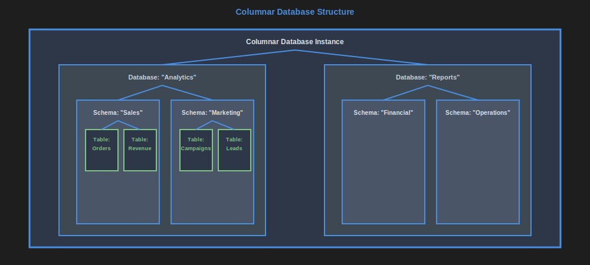
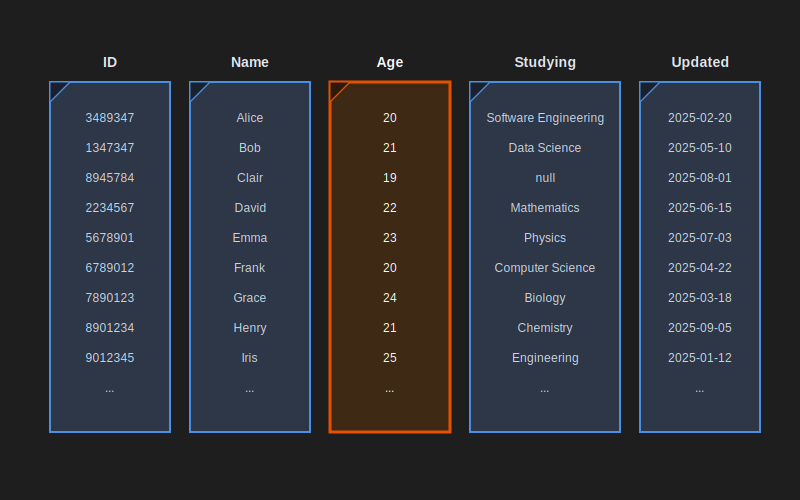

# Columnar databases

<a id="image1" name="image1"></a>



[<<](./wide-column-dbs.md#image3), [>>](./columnar-dbs.md#image2)

Columnar databases are analytical databases that store data column-by-column rather than row-by-row, optimized for read-heavy analytical workloads and aggregations.

Structure:

- Instance (the server or cluster you deployed the database engine on)
    - Database
        - Schema (logical grouping of tables)
            - Table (see below)
                - Column (the data you store)

Common examples include Databricks Delta, GCP BigQuery, Snowflake.

<a id="image2" name="image2"></a>



[<<](./columnar-dbs.md#image1), [>>](./message-queues.md#image1)

Like in relational databases, tables have a structure definition, however, unlike relational databases, the data is stored column-wise, not row-wise and unlike relational databases, some databases (e.g. Delta and BigQuery) support defining nested structures and some databases (e.g. RedShift and Snowflake) support unstructured columns as an alternative to this.

Data is stored column-wise, meaning all values for a single column are stored together, which enables:

- High compression ratios (similar values compress well)
- Fast aggregations (only read needed columns)
- Efficient filtering and scanning

Example table structure:

ID | Name | Age | Department | Salary
--- | --- | --- | --- | ---
1001 | Alice | 25 | Engineering | 75000
1002 | Bob | 30 | Marketing | 65000
1003 | Carol | 28 | Engineering | 80000

In columnar storage, this would be stored as:

- ID column: [1001, 1002, 1003]
- Name column: ["Alice", "Bob", "Carol"]
- Age column: [25, 30, 28]
- Department column: ["Engineering", "Marketing", "Engineering"]
- Salary column: [75000, 65000, 80000]

Most columnar databases use SQL as their query language, making them familiar to developers. Others add SQL via an additional layer above the database e.g. using Impala above parquet files stored in [distributed file storage](./distributed-file-storage.md).

Each database vendor has its own extensions for supporting querying tables with nested data.

Example table with nested data:

```SQL
create table analytics.employees_detailed (
    ID bigint not null,
    Name varchar(200) not null,
    Age smallint,
    Department varchar(100),
    Salary bigint,
    Address struct<
        Street varchar(200),
        City varchar(100),
        Country varchar(50),
        PostalCode varchar(20)
    >,
    Skills array<string>,
    Projects array<struct<
        ProjectName varchar(200),
        Role varchar(100),
        StartDate date,
        EndDate date
    >>
)
```

For example in Delta:

```SQL
-- Select by sub-object field value
select Name, Department, Salary
from analytics.employees_detailed
where Address.City = 'New York'

-- List of strings containing string
select Name, Skills
from analytics.employees_detailed
where array_contains(Skills, 'Python')

-- List of objects containing object with field value
select Name, explode(Projects) as project
from analytics.employees_detailed
where exists(Projects, x -> x.Role = 'Lead Developer')
```

and in BigQuery:

```SQL
-- Select by sub-object field value
SELECT Name, Department, Salary
FROM `analytics.employees_detailed`
WHERE Address.City = 'New York'

-- List of strings containing string
SELECT Name, Skills
FROM `analytics.employees_detailed`
WHERE 'Python' IN UNNEST(Skills)

-- List of objects containing object with field value
SELECT Name, project
FROM `analytics.employees_detailed`,
UNNEST(Projects) AS project
WHERE project.Role = 'Lead Developer'
```

and in RedShift:

```SQL
-- Select by sub-object field value (using JSON functions)
SELECT Name, Department, Salary
FROM analytics.employees_detailed
WHERE JSON_EXTRACT_PATH_TEXT(Address, 'City') = 'New York'

-- List of strings containing string (using JSON functions)
SELECT Name, Skills
FROM analytics.employees_detailed
WHERE Skills LIKE '%Python%'

-- List of objects containing object with field value (using JSON functions)
SELECT Name, JSON_EXTRACT_PATH_TEXT(project.value, 'ProjectName') as ProjectName
FROM analytics.employees_detailed,
JSON_ARRAY_ELEMENTS(Projects) as project
WHERE JSON_EXTRACT_PATH_TEXT(project.value, 'Role') = 'Lead Developer'
```

and in Azure Data Lake:

```SQL
-- Select by sub-object field value (using Spark SQL syntax)
SELECT Name, Department, Salary
FROM analytics.employees_detailed
WHERE Address.City = 'New York'

-- List of strings containing string
SELECT Name, Skills
FROM analytics.employees_detailed
WHERE array_contains(Skills, 'Python')

-- List of objects containing object with field value
SELECT Name, explode(Projects) as project
FROM analytics.employees_detailed
WHERE exists(Projects, x -> x.Role = 'Lead Developer')
```

and in Snowflake:

```SQL
-- Select by sub-object field value
SELECT Name, Department, Salary
FROM analytics.employees_detailed
WHERE Address:City = 'New York'

-- List of strings containing string
SELECT Name, Skills
FROM analytics.employees_detailed
WHERE ARRAY_CONTAINS('Python'::variant, Skills)

-- List of objects containing object with field value
SELECT Name, project.value
FROM analytics.employees_detailed,
LATERAL FLATTEN(input => Projects) project
WHERE project.value:Role = 'Lead Developer'
```

Columnar database enable analytics of massive amounts of data with relatively low latency (for analytics) and high throughput, yet higher latency for simple operations than other database types. Modern columnar databases have a separation between storage and computer resources, which enables scaling up and down compute power on-demand.

Columnar databases are used for Data Warehouses and Data Lakes.

Advantages:

- Extremely fast for analytical queries and aggregations
- High compression ratios reduce storage costs
- Excellent for read-heavy workloads
- Can handle petabytes of data efficiently
- Optimized for business intelligence and reporting

Disadvantages:

- Slow for transactional operations (individual row updates)
- Not suitable for OLTP (Online Transaction Processing)
- Insert/update operations are expensive
- Queries selecting many columns can be slower than row-based storage
- Limited real-time data modification capabilities

When to use:

- Data warehousing and analytics
- Business intelligence and reporting
- Time-series data analysis
- Large-scale aggregations and statistical analysis
- Read-heavy workloads with infrequent updates

When NOT to use:

- High-frequency transactional systems
- Applications requiring real-time updates
- Systems with frequent small inserts/updates
- Applications needing low-latency individual record lookups
- Operational databases for web applications

Signs you are misusing:

- Frequent single-row updates or deletes
- Real-time transactional requirements
- Applications that need immediate data consistency
- Queries that always select all columns from tables

**See also:**

- [Data modelling and columnar databases](./data-modelling-columnar-dbs.md)

---

**Navigation:**

- Previous page: [Wide-columns databases](./wide-column-dbs.md)
- Next page: [Message Queues](./message-queues.md)
