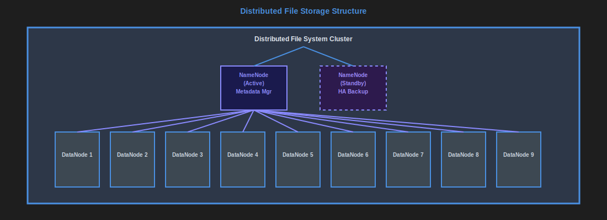
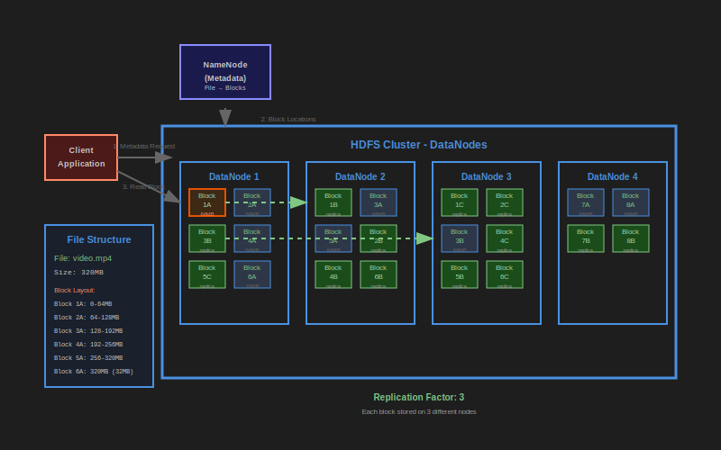

# Distributed File Storage

[previous image](./message-topics.md#image2), [next image](./distributed-file-storage.md#image2)

Distributed file storage systems store files across multiple machines or nodes in a network, providing scalability, redundancy, and fault tolerance. These systems are designed to handle large amounts of data and provide high availability by distributing data across multiple locations.

Common examples include:

- Google Cloud Storage
- Hadoop Distributed File System (HDFS)
- Amazon S3
- Azure Blob Storage

[previous image](./distributed-file-storage.md#image1), [next image](./vector-dbs.md#image1)

Key characteristics:

- **Scalability**: Can handle petabytes of data by adding more nodes
- **Fault tolerance**: Data is replicated across multiple nodes
- **Consistency models**: Various levels of consistency depending on the system
- **Access patterns**: Optimized for different use cases (streaming, batch processing, etc.)

You can use different file formats for different use cases such as parquet files as a columnar database without updated.

You can also store searchable meta data in one database type, that contains a location of file and data within file stored in a distributed file storage, to enable random access together with large data stored in files.

Advantages:

- High availability and durability
- Massive scalability
- Cost-effective for large datasets
- Geographic distribution possible

Disadvantages:

- Higher latency compared to local storage
- Complexity in data consistency
- Network dependency
- Eventually consistent in many cases

When to use:

- File storage
- Binary data storage
- "Cold" data storage
- Very large data storage with minimal storage costs

When NOT to use:

- Data with frequent updates
- When low latency is required
- For storing "hot" data with small TTL
- If there are any concurrency or transactional requirements
- For data that needs to be queried if you don't have a query layer above this

**See also:** [Data modelling and distributed file storage](./data-modelling-distributed-file-storage.md)

---

**Navigation:**

- Previous: [Message Topics](./message-topics.md)
- Next: [Vector Databases](./vector-dbs.md)
