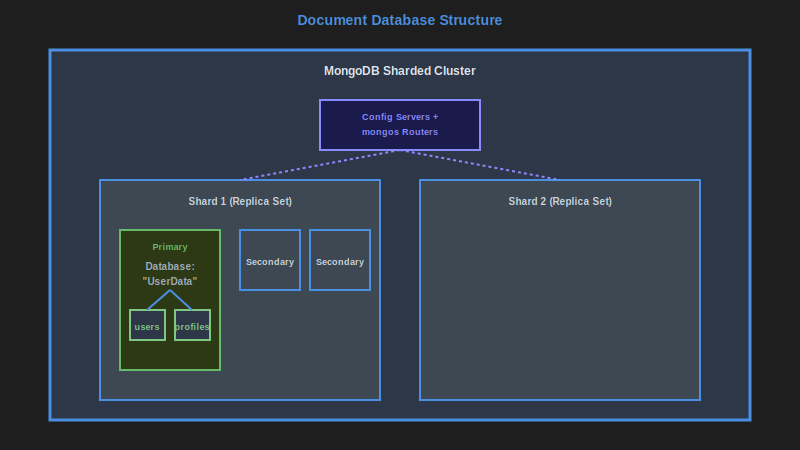
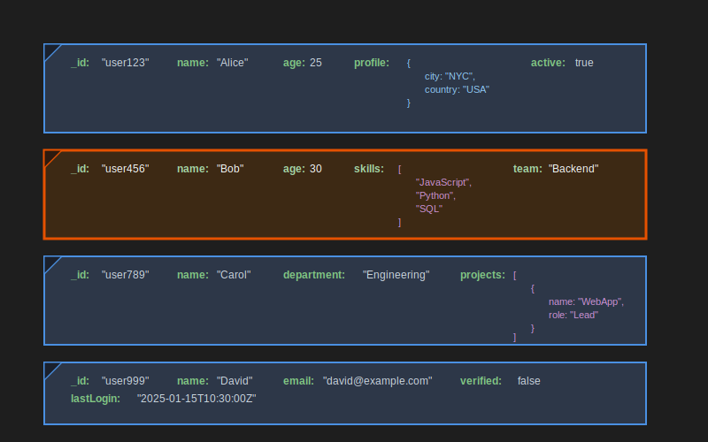
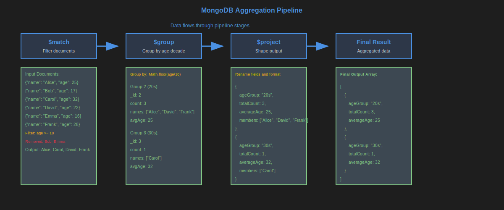

# Document databases

<a name="image1" id="image1"></a>



[<<](./relational-dbs.md#image3), [>>](./document-dbs.md#image2)

Document Databases are one of the various types of NoSQL databases.

Document Databases can have sharding to divide data across multiple instances by key in order to increase throughput of both reads and writes.

Document Databases can have replica sets which enable both redundancy of data and higher throughput of reads by reading from secondary instances.

Document Databases are comprised of the following structure:

- Instance
    - Database
        - Collection
            - Document (the data you store)

Common examples include MongoDB, Atlas (by MongoDB), AWS DocumentDB, Azure CosmosDB.

<a name="image2" id="image2"></a>



[<<](./document-dbs.md#image1), [>>](./document-dbs.md#image3)

Unlike in relation databases, collections do not have a pre-defined structure/schema.
Theoretically, each document stored in a collection could have completely different fields, however, the assumption is that each database (and of course collection) is behind a single data entry point (e.g. micro-service) which is responsible for the data validity.

Documents are viewed as JSON and stored as BSON (binary form of JSON).

Also unlike in relation databases, you do not need to create a database or collection in advance before storing documents.

```MongoDB
db_name.collection_name.insertOne({
    "_id": "some ID",
    "name": "some name",
    "age": 21,
    "is_a_document": true
})
```

```MongoDB
db_name.collection_name.insertMany([
    {
        "_id": "some ID",
        "name": "some name",
        "age": 21,
        "is_a_document": true
    },
    {
        "_id": "another ID",
        "name": "another name",
        "age": null,
        "more_info": {
            "extra_name": "nickname goes here",
            "hobbies": ["searching for data", "JavaScript"]
        },
    }
])
```

All documents have a primary key named "_id", which can be of various types e.g. GUID/UUID, string, int.

Fields can be indexed including sub-fields and list-items e.g.

```MongoDB
db_name.collection_name.createIndex(
    {
        "more_info.hobbies": 1
    },
    {
        "sparse": false
    }
)
```

which enables flexible searching.

(more details in [data modelling](./data-modelling-document-dbs.md))

Example for searching:

```MongoDB
db_name.collection_name.find(
    {
        "more_info.extra_name": "nick"
    }
)
```

```MongoDB
db_name.collection_name.find(
    {
        "$and": [
            {"more_info.extra_name": "nick"},
            {"age": {"$gt": 18}}
        ]
    }
)
```

Updating:

```MongoDB
db_name.collection_name.updateOne(
    {"_id": "some ID"},
    {"$inc": {"age": 1}, "$push": {"more_info.hobbies": "swimming"}}
)
```

Upserting:

```MongoDB
db_name.collection_name.updateOne(
    {"_id": "some ID"},
    {"$set": {
        "name": "some name",
        "age": 22
    }},
    {upsert: true}
)
```

Deleting:

```MongoDB
db_name.collection_name.deleteOne(
    {"_id": "some ID"}
)
```

Aggregate data:

```MongoDB
db_name.collection_name.aggregate([
    {
        "$match": {"age": {"$gte": 18}}
    },
    {
        "$group": {
            "_id": "$name",
            "number_of_students": {"$sum": 1}
        }
    },
    {
        "$project": {
            "_id": 0,
            "name": "$_id",
            "number_of_students": 1
        }
    }
])
```

<a name="image3" id="image3"></a>



[<<](./document-dbs.md#image2), [>>](./key-value-dbs.md#image1)

Multi-stage aggregation pipeline processing documents through filter, group, and projection stages.

Advantages:

- You can store all relevant data in one place, without splitting into multiple collections due to depth or multiple values
- Low latency
- High throughput
- Data can be partitioned by a partitioning field
- You can isolate reads and writes to different instances to improve performance
- You can choose between consistent or eventually-consistent modes via config
- Index by sub-fields and even list-items
- Indices can include TTL (time to live)

Disadvantages:

- Limited concurrency protection, you can use atomic updates for single document operations, however, this is not the place to store critical information like account balances
- Partitioning requires a more complex deployment and management (unless you are using a SaaS like Atlas, DocumentDB, CosmosDB)
- While search, update and aggregation-pipeline are rich in commands, they have less options than SQL
- DocumentDB and CosmosDB do not have full MongoDB support, so you need to take this into account
- Eventual consistency can lead to stale reads in distributed deployments

When to use:

- Nested data with complex object hierarchies
- Data with significant structure changes between items
- Sparse data (with a lot of missing / null fields)
- Data with frequent structure changes
- Caching data that needs to be queried after caching by unpredictable set of columns e.g. cache relation data as documents, then query documents by any set of fields
- Content management systems
- Product catalogs with varying attributes
- User profiles with flexible schemas

When NOT to use:

- Data that requires consistent concurrent modifications to multiple items
- Binary data (use distributed file storage instead)
- Database mainly used for reports, aggregations, statistics, machine learning
- Financial transactions requiring ACID compliance
- Small datasets where relational databases suffice

## Real-World Use Cases

### Forbes Content Management
Forbes uses MongoDB to manage articles, with each article document containing metadata, content, tags, and author information in a flexible schema.

### Adobe's User Profiles
Adobe Creative Cloud uses MongoDB for user profiles, storing preferences, subscription data, and usage analytics in documents that vary significantly between users.

### Bosch IoT Platform
Bosch uses MongoDB for IoT device data, where each device type has different sensor configurations and data structures.

### Craigslist Classifieds
Craigslist uses MongoDB for classified ads, where each category (jobs, housing, items) has different required and optional fields.

Signs you are misusing:

- Data only accessed by key and always pulled in full (with no projection)
- Data is always flat and in constant structure
- Huge amount of data and latency is not important for queries

For best practices on using see [data modelling](./data-modelling-document-dbs.md).

**See also:**

- [Data modelling and document databases](./data-modelling-document-dbs.md)
- [Indexing](./indexing.md)
- [Concurrency and document databases](./concurrency-document-dbs.md)

---

**Navigation:**

- Previous page: [Relational databases](./relational-dbs.md)
- Next page: [Key-Value databases](./key-value-dbs.md)
