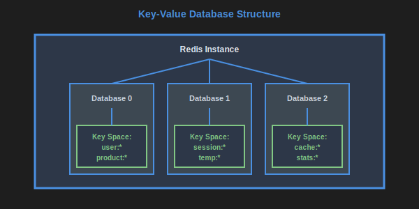
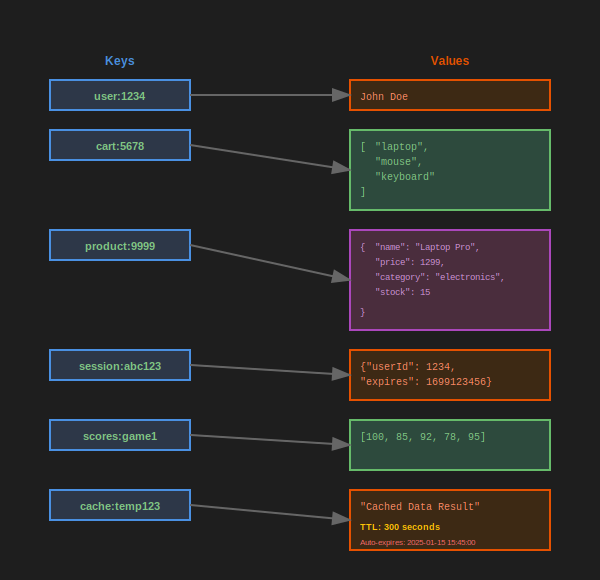

# Key-Value databases

<a name="image1"></a>



[<<](./document-dbs.md#image3), [>>](./key-value-dbs.md#image2)

Key-Value Databases, one of the various types of NoSQL databases, have a very simple structure:

- Instance
    - Database (not always available)
        - Key

Common examples include Redis and AWS ElastiCache.

These databases usually store the entirety of the data in-memory, which results in very low latency.

To enable this, the number of keys they support is limited (e.g. to 2^32 in Redis).

[Wide-column databases](./wide-column-dbs.md) are very similar, however, they are not in memory, they support partitioning of the data and they have other differences too.

<a name="image2"></a>



[<<](./key-value-dbs.md#image1), [>>](./wide-column-dbs.md#image1)

Searching these database is only by key, they do not have other indices.

Nesting of more levels is usually achieved using the convention ":" character within keys, for example:

```Redis
SET my_app:object_type:object_key "value"
```

and the reading back by these same keys

```Redis
GET my_app:object_type:object_key
```

Despite this, Redis and its compatible databases support additional data-structures via various value types, such as:

- string values (set, get, substring, prefix, append, ...)
- integer values (set, get, increment, multiply, bit / binary operations, ...)
- floating point values (set, get, increment, multiply, ...)
- list values (set, get, length, push, pop, append, remove, insert, ...)
- set values (set, get, intersect, union, diff, minus, ...)
- hashset values (set, get, set field, get field, list fields, ...)
- sorted list values
- geo-coordinate values

and more.


For example, with hashset values you can store a single level of key-values under a key:

```Redis
HSET my_app:object_type:object_key field1 "value1"
```

and read all fields:

```Redis
HGETALL my_app:object_type:object_key
```

or a single field:

```Redis
HGET my_app:object_type:object_key field1
```

More about the various data structures and their uses in [data modelling](./data-modelling-key-values-dbs.md).

Advantages:

- Very low latency and high throughput
- Very useful for caching and pub-sub
- Atomic operations prevent concurrency issues
- Built-in data expiration (TTL)
- Rich data structures beyond simple key-value

Disadvantages:

- Limited query capabilities (depends on data structure, mostly only by key)
- Limited data structures supported e.g. scalar value, one-level object with scalar values, list, set, ...
- Memory-based storage limits total data size
- No complex relationships or joins

When to use:

- Flat data only accessed by key
- Very low latency is required
- As distributed mutex/locking
- As pub-sub e.g. for multi-casting local cache invalidation messages to all instances
- For counting and metrics
- For operations on sets, sorted lists and other data structures supported by Redis
- Session storage and caching
- Rate limiting and throttling
- Real-time leaderboards

When NOT to use:

- Data that requires consistent concurrent modifications to multiple items or even multiple fields in item
- Nested data with complex relationships
- Large amount of keys (memory limitations)
- Partitioning of data between instances is required
- For reports, aggregations, statistics, machine learning
- Complex queries or data analysis

## Real-World Use Cases

### GitHub's Session Storage
GitHub uses Redis for storing user sessions, requiring fast access and automatic expiration for security.

### Twitter's Timeline Cache
Twitter uses Redis to cache user timelines, providing sub-millisecond access to recently computed feeds for millions of users.

### Uber's Driver Location
Uber uses Redis geospatial data types to track driver locations in real-time, enabling fast proximity searches for ride matching.

### Stack Overflow's Caching Layer
Stack Overflow uses Redis as a caching layer in front of SQL Server, dramatically reducing database load for frequently accessed questions and answers.

Signs you are misusing:

- If you need to scan keys (a slow, blocking operation)
- If you need multiple instances to hold all you data (not including replication for high availability)

For best practices on using see [data modelling](./data-modelling-key-values-dbs.md).

**See also:**

- [Data modelling and key-value databases](./data-modelling-key-values-dbs.md)
- [Concurrency and key-value databases](./concurrency-key-value-dbs.md)

---

**Navigation:**

- Previous page: [Document databases](./document-dbs.md)
- Next page: [Wide-columns databases](./wide-column-dbs.md)
