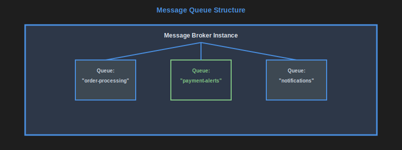
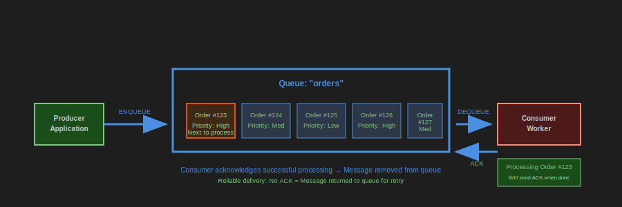
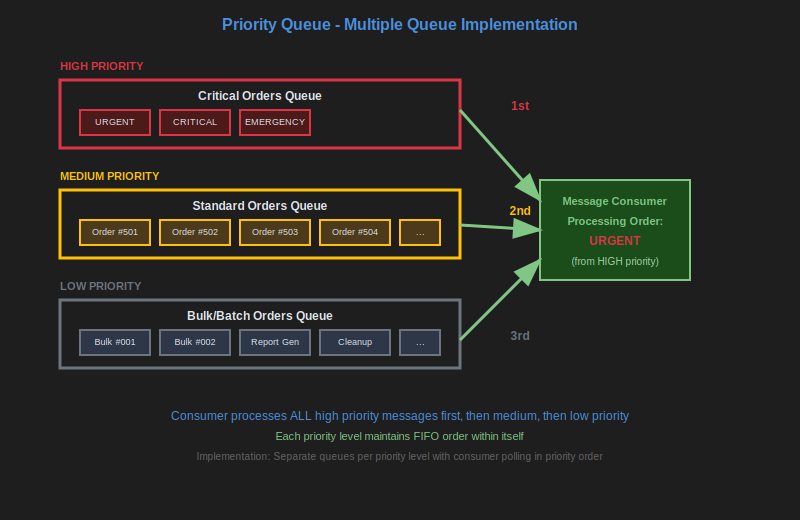

# Message Queues

[previous image](./columnar-dbs.md#image2), [next image](./message-queues.md#image2)

Message queues, like RabbitMQ are point-to-point communication systems where messages are consumed and removed from the queue.

Common examples include RabbitMQ, Amazon SQS, Azure Service Bus, Apache ActiveMQ.

[previous image](./message-queues.md#image1), [next image](./message-queues.md#image3)

Producers publish their messages to a queue, and consumers retrieve and consume messages from the queue.

Once a message is consumed, it is typically removed from the queue, so while multiple instances of a consumer can divide work between them, only one type of consumer can connect to the queue otherwise they will "steal" each other's messages.

Message queues often support:

- Message acknowledgment (consumer confirms successful processing)
- Dead letter queues (for failed messages)
- Message TTL (time-to-live)
- Priority queues
- Delayed/scheduled message delivery

[previous image](./message-queues.md#image2), [next image](./message-topics.md#image1)

Priority queues implemented as separate queues per priority level, with consumers processing high priority messages first.

Advantages:

- Simple point-to-point messaging pattern
- Message durability and persistence
- Load balancing across multiple consumer instances
- Reliable message delivery with acknowledgments
- Dead letter handling for failed messages
- Supports transactional messaging

Disadvantages:

- Messages are consumed once and removed (no replay capability)
- Limited to single consumer type per message
- No message history or rewind functionality
- Can become bottleneck if not properly scaled

**See also:** [Data modelling and messages](./data-modelling-messages.md)

---

**Navigation:**

- Previous: [Columnar databases](./columnar-dbs.md)
- Next: [Message Topics](./message-topics.md)
