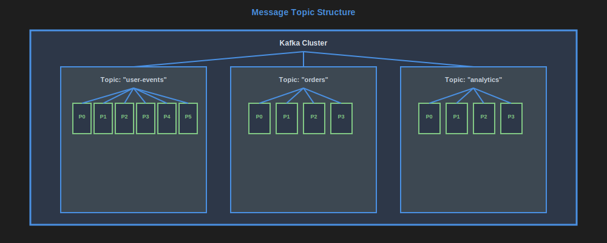
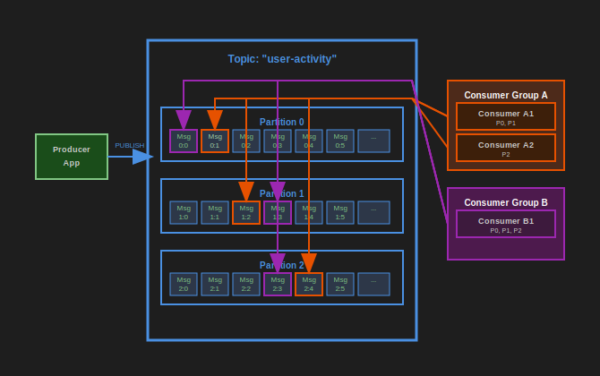

# Message Topics

[<<](./message-queues.md#image3), [>>](./message-topics.md#image2)

Message topics, like Kafka are publish-subscribe messaging systems where messages are retained and can be consumed by multiple independent applications.

Common examples include Kafka, AWS MSK (Managed Streaming for Apache Kafka), Azure Event Hubs, Google Cloud Pub/Sub.

[<<](./message-topics.md#image1), [>>](./distributed-file-storage.md#image1)

Producers publish their messages to a topic, which keeps all message storage for a given duration (retention set per topic in days).

Topics are split into **partitions**, to enable multiple consumer instances and distributed writes to topic. Partitions provide:
- Parallel processing capability
- Ordered message processing within each partition
- Scalability through distribution across multiple brokers

Each type of consumer (each consuming application/service) has a "bookmark" called an **offset** per partition of the topic. This offset enables consumer to "remember" what is the next message that needs to be read.

Key concepts:
- **Consumer Groups**: Multiple instances of the same application that share the workload
- **Topic Retention**: Messages are kept for a configurable time period (hours to months)
- **Message Ordering**: Guaranteed within a partition, but not across partitions
- **Replication**: Topics can be replicated across multiple brokers for fault tolerance

This enables multiple types of consumers to process the same messages without competing between them, whereas each instance of the same consumer type reads different messages (each from a different set of partitions).

The number of consumers per application type (referred to as consumer group) is limited to the number of partitions - only one instance can read at the same time per partition, however, each instance can read from more than one partition.

Advantages:

- Multiple applications can each process messages from the same topic without interfering with each other
- Distributed writes and reads for high throughput
- Enables rewind of messages by moving back offsets (replay capability)
- Supports message compression
- High availability through replication
- Horizontal scalability through partitioning
- Event sourcing and audit trail capabilities
- Decouples producers from consumers

Disadvantages:

- Need to configure amount of partitions in advance
- Too much retention can increase storage costs
- More complex than traditional message queues
- No ordering guarantees across partitions
- Consumer lag monitoring required
- Operational complexity for cluster management

When to use:

- Event streaming and real-time analytics
- Microservices communication requiring replay capability
- Event sourcing architectures
- High-throughput data pipelines
- Log aggregation and monitoring
- Real-time data processing

When NOT to use:

- Simple point-to-point messaging (use message queues instead)
- Low-latency request-response patterns
- Small-scale applications with minimal throughput requirements
- When message ordering across all messages is critical

## Real-World Use Cases

### Netflix's Event Streaming
Netflix uses Kafka to stream billions of events daily for personalization, recommendations, and operational monitoring across 200M+ subscribers.

### LinkedIn's Activity Feeds
LinkedIn uses Kafka (which they originally created) to power activity feeds, processing millions of member interactions and updates in real-time.

### Uber's Trip Events
Uber uses Kafka to handle trip lifecycle events (requests, matches, pickups, completions) enabling real-time pricing, driver positioning, and analytics.

### Airbnb's User Analytics
Airbnb uses Kafka to stream user behavior events for personalization, A/B testing, and business intelligence across their platform.

### Spotify's Music Streaming
Spotify uses Kafka to handle music streaming events, user interactions, and recommendation engine data processing for millions of concurrent users.

## Key Design Considerations

### Partition Strategy
- **By User ID**: Ensures all events for a user go to same partition (preserves order)
- **By Geography**: Distributes load based on regional activity patterns
- **Round Robin**: Even distribution when order doesn't matter

### Retention Planning
- **Operational Events**: 1-7 days retention
- **Analytics Events**: 30-90 days retention  
- **Audit Logs**: Months to years retention
- **Event Sourcing**: Indefinite retention with compaction

**See also:** [Data modelling and messages](./data-modelling-messages.md)

---

**Navigation:**

- Previous page: [Message Queues](./message-queues.md)
- Next page: [Distributed File Storage](./distributed-file-storage.md)
