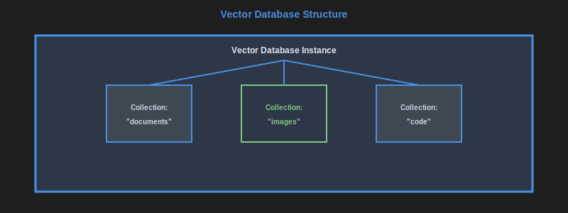

# Vector Databases

<a name="image1" id="image1"></a>



[<<](./distributed-file-storage.md#image2), [>>](./vector-dbs.md#image2)

To enable searching textual documents or images by meaning, and not just by keywords, you can use embeddings from large language models (LLMs) such as models from HuggingFace, OpenAI, etc. These embeddings transform text into numeric vectors with hundreds or thousands of dimensions, capturing semantic meaning, so that similar meaning results in similar vectors.

Vector databases store documents and metadata together with these embedding vectors and enable searching for documents with similar meaning to a given input.

Vector databases are primarily used for AI/ML applications, particularly those involving embeddings from machine learning models. They are optimized for similarity search and retrieval tasks, making them ideal for applications such as semantic search, recommendation systems, and Retrieval-Augmented Generation (RAG) systems.

Common examples include: ChromaDB, LLamaIndex, Faiss, Weaviate, Pinecone, etc.

<a name="image2" id="image2"></a>


[<<](./vector-dbs.md#image1), [>>](./vector-dbs.md#image3)

Documents and images transformed into high-dimensional vectors using ML models, capturing semantic meaning for similarity search.

## Vector database vs. Elasticsearch

While both vector database and Elasticsearch enable searching documents, they do so in different ways:

<a name="image3" id="image3"></a>


[<<](./vector-dbs.md#image2) [>>](./database-types-summary.md#comparison-table)

- **Vector Database**: Uses high-dimensional vectors to represent the **semantic meaning** of documents. It excels at finding similar items based on meaning, making it ideal for applications like semantic search and recommendations. It uses distance metrics (like cosine similarity) to find the closest vectors.

- **Elasticsearch**: Primarily a text-based search engine that uses inverted indices to quickly find documents containing **specific keywords**. It is optimized for keyword-based searches and can handle structured data well, but it may not capture the semantic meaning of documents as effectively as vector databases.

## Adding a document to a vector database

When setting up a vector database, you typically need to **choose or create an embedding model**: Select a pre-trained model (e.g. from HuggingFace) or train your own to generate embeddings for your documents.

Adding documents:

Example ChromaDB Python code to add documents:

```python
import chromadb
import uuid
import datetime

# Initialize ChromaDB client to use a local docker-based instance
vector_db_client = chromadb.HttpClient(host="localhost", port=8000)
vector_collection = vector_db_client.get_or_create_collection(name="my_collection")

vector_collection.add(
    # The document text to be embedded and stored
    documents=[
        "This is a sample document about AI and machine learning.",
        "Another document discussing the benefits of vector databases.",
    ],
    metadatas=[
        # Metadata for search filtering and identification of the documents
        {
            "source": "document1.txt",
            "created_at": datetime.datetime.now(datetime.timezone.utc).isoformat(),
        },
        {
            "source": "document2.txt",
            "created_at": datetime.datetime.now(datetime.timezone.utc).isoformat(),
        }
    ],
    ids=[
        # Unique identifier for each document, a better approach is to use an external ID or the hash of the document
        str(uuid.uuid4()),
        str(uuid.uuid4()),
    ]
)
```

## Querying a vector database

Example ChromaDB Python code to query a vector database:

```python
import chromadb

vector_db_client = chromadb.HttpClient(host="localhost", port=8000)
vector_collection = vector_db_client.get_or_create_collection(name="my_collection")

input_query = "What are the advantages of using vector databases for AI applications?"

results = vector_collection.query(
    query_texts=[input_query],
    n_results=3,  # Number of similar documents to retrieve
    where={
        # Optional metadata filtering
        "source": "document1.txt"
    }
)
```

Key characteristics:

- **High-dimensional vectors**: Store dense vectors with hundreds or thousands of dimensions
- **Similarity search**: Find vectors that are "similar" using distance metrics (cosine, euclidean, dot product)
- **Approximate nearest neighbor (ANN)**: Fast approximate search algorithms for large datasets
- **Embedding support**: Optimized for storing and querying ML model outputs
- **Metadata filtering**: Combine vector similarity with traditional attribute filtering

Advantages:

- Extremely fast similarity search at scale
- Purpose-built for AI/ML workloads
- Handles high-dimensional data efficiently
- Supports real-time recommendations and search
- Integrates well with ML pipelines
- Advanced indexing algorithms (HNSW, IVF, etc.)

Disadvantages:

- Limited to similarity-based queries
- Requires understanding of vector embeddings
- Memory intensive for large datasets
- Complex operational setup
- Limited traditional database features
- Approximate results (trade-off for speed)

When to use:

- Semantic search and retrieval
- Recommendation systems
- Image/video similarity search
- Natural language processing applications
- Retrieval-Augmented Generation (RAG) systems
- Anomaly detection
- Content-based filtering

When NOT to use:

- Traditional relational data operations
- Exact match queries on structured data
- When you don't have vector embeddings
- Simple key-value lookups
- Transactional operations requiring ACID properties
- Small datasets where simple algorithms suffice

**See also:**

- [Data modelling and vector databases](./data-modelling-vector-dbs.md)

---

**Navigation:**

- Previous page: [Distributed File Storage](./distributed-file-storage.md)
- Next page: [Database types summary](./database-types-summary.md)
